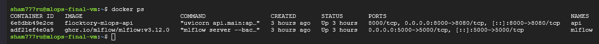
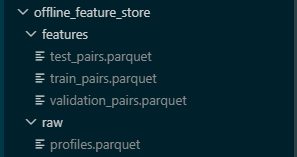

# Dedublication system - MLOps
Реализация полной ML-системы по проекту дедубликации профелей маркетплейсов из моего портфолио - https://github.com/antosden/flocktory-dedublication-system.git

В рамках проекта была реализована система, упакованная в Docker Compose, но без CI/CD и MLOps. 
Данные компоненты будут доработана в данном репозитории.

## Шаг 1. Постановка цели. 
Выберите самую простую и понимаемую бизнес-задачу (например, для расчета складских запасов магазина достаточно трех таблиц — товар, склад, заказ). Выберите одну бизнес-метрику. Перепишите бизнес-требования на язык ML-проектирования.

**Цель:** разработать систему автоматического поиска и объединения дубликатов профилей клиентов на маркетплейсе скидок.

**Проблема:** один человек может иметь несколько профилей (разные email, телефоны, варианты ФИО), что приводит к:
- Размыванию истории покупок и предпочтений
- Неточной персонализации и маркетингу
- Искажённой аналитике (LTV, Retention, RFM)
- Возможностям для фрода (многократное получение бонусов)

**Бизнес-метрика:** Precision автоматического объединения профилей

**ML-задача**

Построить модель бинарной классификации, которая для пары клиентских профилей определяет:

- 1 — профили принадлежат одному пользователю
- 0 — профили принадлежат разным пользователям

**Объект предсказания**: Пара профилей (profile_1, profile_2)

**Входные данные**

Для каждой пары рассчитываются признаки сходства:

- совпадение телефона
- совпадение даты рождения
- сходство имени
- сходство фамилии
- сходство email
- сходство feature-списков

**Выход модели**

Вероятность того, что профили принадлежат одному человеку: match_score ∈ [0;1]

**Целевая метка**

is_duplicate

- 1 — дубль
- 0 — не дубль

**Метрика ML:** Precision

**Критерий успеха проекта**

Система должна автоматически определять дубли клиентов с качеством не ниже заданного порога - Precision ≥ 0.90

## Шаг 2. Выбор уровня сложности реализуемой системы. 
Составьте одностраничный манифест разработки ML-системы. Это ваш план, в котором вы заявляете уровень зрелости будущей ML-системы (0,1 или 2).

### 1. Предыстория

Информация из ТЗ заказчика:

```
**Цель:** создать алгоритм и прототип системы автоматического поиска и объединения дубликатов профилей клиентов по неполным и зашумленным данным (ФИО, email, телефон, дата рождения, город и др.), чтобы повысить качество клиентской базы, точность персонализации и корректность аналитики на маркетплейсе.

**Подробнее о задаче.** В клиентских базах крупных маркетплейсов неизбежно накапливаются дубликаты профилей: один и тот же человек может зарегистрироваться несколько раз с разными имейлами, телефонами или вариантами написания имени. Это создает ряд проблем:
- история покупок, предпочтения и поведение одного клиента «размазаны» по нескольким аккаунтам;
- рекомендации и маркетинговые кампании теряют точность;
- один человек получает несколько карт лояльности и бонусов;
- аналитика искажается: LTV, Retention, RFM-анализ, когортный анализ считаются некорректно;
- появляются возможности для фрода.

Ваша задача — разработать систему Entity Resolution: надежный пайплайн, который определяет, относятся ли несколько профилей к одному реальному человеку, и предлагает их автоматическое или полуавтоматическое объединение. Задача нетривиальна: данные зашумлены, неполны и представлены в разных форматах. Простого точного совпадения полей недостаточно — нужны признаки сходства, модель матчинга и кластеризация совпадений в связные компоненты. 
```

### 2. Ценностное предложение

Система позволит повысить качество клиентской базы за счёт автоматического поиска дублей. Это улучшит персонализацию, маркетинговые кампании, расчёт LTV, Retention и RFM-аналитики.

Для бизнеса ценность состоит в снижении ошибок клиентской аналитики, уменьшении фрода и сокращении ручной работы по поиску дубликатов.

### 3. Цели	

Ключевые задачи системы:

- Принимать batch-файлы с профилями клиентов.
- Хранить исходные данные и метаданные обработки.
- Формировать пары профилей-кандидатов для сравнения.
- Рассчитывать признаки сходства между профилями.
- Обучать модель бинарной классификации для определения дублей.
- Выполнять inference модели на новых данных.
- Формировать рекомендации: auto_merge, manual_review, no_duplicate.
- Объединять связанные профили в кластеры.
- Отслеживать качество модели и принимать решения о переобучении.
- Безопасно переводить новую модель в production только при прохождении quality gate.

### 4. Решение

ML-система batch-processing типа.

Система уже включает:

- интерфейс для загрузки batch-файлов и просмотра результатов;
- API-сервис для управления обработкой;
- объектное хранилище для исходных файлов;
- базу данных для хранения профилей, статусов, predictions и clusters;
- очередь задач для асинхронной обработки;
- ML-пайплайн для blocking, feature engineering, inference и clustering;

В рамках работы необходимо доработать:
- систему трекинга экспериментов и registry моделей;
- оркестратор для регулярного переобучения модели;
- мониторинг технических, модельных и бизнес-метрик.

Заявляемый уровень зрелости ML-системы: уровень 2.

Исходная архитектура уже реализованной системы:


Необходимо привести часть ML Pipeline к архитектуре уровня зрелости 2:


Обоснование: система предполагает версионирование кода, CI/CD, feature store или его упрощённый аналог, model registry, мониторинг качества, оркестратор retraining pipeline и механизм принятия решения о переводе новой модели в production.

В продукт не входит real-time inference, автоматическое физическое объединение аккаунтов в CRM без подтверждения бизнес-правил, а также полноценный интерфейс ручной модерации на первом этапе.


### 5. Осуществимость

Решение осуществимо, так как задача решается средствами классического ML для табличных данных и batch-processing архитектуры.

Для реализации потребуются:

- оркестратор пайплайнов;
- feature store;
- инструмент трекинга экспериментов.

### 6. Данные

Синтетический датасет был представлен заказчиком.

Основные поля:

- profile_id;
- entity_id;
- created_at;
- first_name;
- last_name;
- email;
- phone;
- birthday;
- sex;
- дополнительные feature-поля.

Разметка строится по entity_id: если два разных profile_id имеют одинаковый entity_id, пара считается дублем;

entity_id не будет использоваться как признак модели. Он нужен только для обучения и offline evaluation.

Продовые данные будут поступать в виде новых batch-файлов без известного entity_id.

### 7. Метрики

Основная бизнес-метрика - Precision автоматического объединения профилей.

Дополнительные бизнес-показатели:

- доля найденных дублей;
- доля профилей, отправленных на ручную проверку;
- снижение количества дубликатов в клиентской базе;
- снижение ошибок персонализации;
- снижение риска повторного начисления бонусов одному пользователю.

Приоритет отдаётся Precision, потому что ошибочное объединение разных пользователей является более критичным, чем пропуск части дублей.

### 8. Оценка качества модели	

Offline-метрики:

- Precision;
- Recall;
- F1-score;
- ROC-AUC;
- confusion matrix.

Основной quality gate:

Precision >= 0.90;
новая модель не должна ухудшать F1-score относительно production-модели.

Online-метрики:

- распределение match_score;
- доля auto_merge;
- доля manual_review;
- доля no_duplicate;
- количество кластеров;
- средний размер кластера;
- доля подтверждённых и отклонённых ручных проверок.

### 9. Подбор модели

Подбор модели будет выполняться итеративно.

Планируется сравнить несколько моделей для табличных данных:

- baseline-модель;
- LightGBM;
- CatBoost.

Каждая новая модель будет обучаться на одинаковой схеме признаков и сравниваться с текущей production-моделью.

Если candidate-модель проходит quality gate, она переводится в production. Если качество ниже порога, модель отклоняется и текущая production-модель остаётся активной.

Такой подход позволяет безопасно обновлять модель и не выкатывать ухудшающие версии.

### 10. Инференс

Система будет выполнять batch inference.

Обоснование:

- задача не требует real-time ответа;
- данные поступают пакетами;
- необходимо сравнивать новые профили с исторической базой;
- blocking и кластеризация удобнее выполняются пакетно;
- batch-processing проще контролировать и переиспользовать при ошибках.

Inference pipeline:

- Загрузка batch-файла.
- Сохранение данных и metadata.
- Генерация пар-кандидатов через blocking.
- Расчёт признаков сходства.
- Получение match_score.
- Формирование бизнес-рекомендации.
- Построение кластеров.
- Сохранение результатов.

### 11. Обратная связь

Источники обратной связи:

- результаты ручной проверки manual_review;
- жалобы на ошибочное объединение;
- статистика отклонённых объединений;
- изменение распределения входных данных;
- изменение распределения match_score;
- изменение доли auto_merge, manual_review, no_duplicate.

MDD будет использоваться: да.

Решения о развитии системы будут приниматься на основе метрик. Например, если новая модель показывает статистически значимое улучшение качества и проходит quality gate, она может быть переведена в production. Если метрики ухудшаются, модель отклоняется или откатывается.

### 12. Управление проектом

Модели уже реализованы командой из 3х Data Science в рамках практикума, + базовая инфраструктура для работы системы была реализована мной (Data Engineer).
В данном проекте я буду дорабатывать MLOps пайплайн в качестве MLOps инженера.

Ожидаемые результаты:

- архитектура ML-системы;
- код пайплайна;
- контейнеризированная инфраструктура;
- пайплайн обучения модели;
- пайплайн inference;
- model registry;
- описание SLI/SLO;
- MDD/ADR-документ;
- README и инструкция запуска;
- демонстрация работы сервиса.

Оценочный срок реализации всего MVP: 1–2 недели, из которых 2-3 дня уделяется настройке MLOps.

## Шаг 3. Создание ML-системы. 
Создайте с помощью любого декларативного инструмента инфраструктуру с таким количеством компонентов, которое требуется для выбранной архитектуры ML-системы. Не нужно гнаться за модой — включать сразу все возможные компоненты из перечня.

Развёрнутое решение в GCD: http://34.76.222.57:5000/


API healthcheck: http://34.76.222.57:8000/health

Деинсталляция: 
```
docker compose down -v --remove-orphans
```

## Шаг 4. Управление рисками. 
Ни одна система не имеет 100% надежности, но тем не менее для каждого компонента инфраструктуры напишите индикатор SLI и SLO, который показывает нормальную работу системы.

### SLI/SLO для MLOps-системы дедупликации профилей

#### 1. Общая цель мониторинга

Система предназначена для поиска дубликатов профилей клиентов на маркетплейсе скидок.  
Мониторинг должен контролировать не только техническое состояние сервисов, но и качество ML-модели, так как ошибочное автоматическое объединение разных пользователей может привести к бизнес-рискам.

Основной приоритет системы — высокая точность автоматического объединения профилей.

---

#### 2. Model Serving Component

Компонент: FastAPI-сервис для получения предсказаний модели.

**SLI**

- Доступность API.
- Latency endpoint `/predict`.
- Доля ошибочных HTTP-ответов 5xx.
- Доля невалидных запросов 4xx.
- Количество prediction-запросов в минуту.

**SLO**

- Доступность API: не ниже 99% в месяц.
- P95 latency endpoint `/predict`: не более 500 мс.
- Доля 5xx-ошибок: не более 1% запросов.
- Доля невалидных 4xx-запросов: не более 5% запросов.

**Риск нарушения**

Если API недоступен или отвечает слишком медленно, downstream-сервисы не смогут получать рекомендации по объединению профилей.

---

#### 3. Model Training Infrastructure

Компонент: скрипты подготовки данных и обучения моделей.

**SLI**

- Успешность запуска `prepare_dataset.py`.
- Успешность запуска `train_baseline.py`.
- Успешность запуска `train_candidate.py`.
- Время выполнения пайплайна подготовки данных.
- Время обучения модели.
- Наличие сохранённого model artifact.

**SLO**

- Успешность training pipeline: не ниже 95% запусков.
- Время подготовки датасета: не более 30 минут для учебного объёма данных.
- Время обучения модели: не более 30 минут для учебного объёма данных.
- После успешного обучения model artifact должен быть сохранён в `model_artifacts/`.

**Риск нарушения**

Если training pipeline нестабилен, команда не сможет воспроизводимо обучать и сравнивать новые версии модели.

---

#### 4. Feature Store / Offline Feature Layer

Компонент: offline feature datasets в parquet-формате.

В учебной реализации feature store представлен как offline feature layer:

- `offline_feature_store/raw/profiles.parquet`
- `offline_feature_store/features/train_pairs.parquet`
- `offline_feature_store/features/validation_pairs.parquet`
- `offline_feature_store/features/test_pairs.parquet`



**SLI**

- Наличие исходного parquet-файла.
- Наличие train/validation/test feature datasets.
- Доля пропусков в ключевых признаках.
- Количество строк в train/validation/test.
- Баланс классов по `label`.

**SLO**

- Все обязательные feature-файлы должны существовать после запуска `prepare_dataset.py`.
- Доля полностью пустых feature rows: 0%.
- Доля положительного класса должна быть ненулевой во всех выборках.
- Train, validation и test не должны пересекаться по `entity_id`.

**Риск нарушения**

Если признаки сформированы некорректно, модель может обучиться на невалидных данных или получить data leakage.

---

#### 5. ML Metadata Store

Компонент: MLflow Tracking.

**SLI**

- Наличие experiment `profile-deduplication`.
- Наличие run для baseline-модели.
- Наличие run для candidate-модели.
- Наличие залогированных параметров модели.
- Наличие залогированных метрик качества.
- Наличие model artifact.

**SLO**

- Каждый training run должен логировать параметры модели.
- Каждый training run должен логировать метрики `precision`, `recall`, `f1`, `roc_auc`.
- Каждый training run должен сохранять model artifact.
- Для каждой candidate-модели должен быть сохранён результат quality gate.

**Риск нарушения**

Если metadata не сохраняется, невозможно воспроизвести эксперимент и объяснить, почему модель была принята или отклонена.

---

#### 6. Model Registry

Компонент: MLflow Model Registry.

**SLI**

- Наличие зарегистрированной baseline-модели.
- Наличие зарегистрированной candidate-модели.
- Наличие production alias у принятой модели.
- Наличие тегов model version.

**SLO**

- Candidate-модель должна попадать в registry после успешного обучения.
- Production alias может быть назначен только после прохождения quality gate.
- У production-модели должны быть сохранены теги:
  - `deployment_status=production`
  - `promoted_by=quality_gate`

**Риск нарушения**

Если registry не контролируется, в production может попасть модель без проверки качества.

---

#### 7. CI/CD Component

Компонент: GitHub Actions.

**SLI**

- Статус pipeline.
- Успешность установки зависимостей.
- Успешность проверки Python-кода.
- Успешность тестов.
- Успешность MLOps pipeline stages.

**SLO**

- Pipeline должен успешно проходить на основной ветке.
- Проверка импортов и синтаксиса должна выполняться при каждом push.
- MLOps-скрипты должны запускаться при наличии обучающего датасета.
- Артефакты pipeline должны сохраняться.

**Риск нарушения**

Если CI/CD не работает, изменения в коде могут ломать воспроизводимость ML-пайплайна.

---

#### 8. Model Quality Monitoring

Компонент: мониторинг качества модели.

**SLI**

- Validation Precision.
- Validation Recall.
- Validation F1.
- Validation ROC-AUC.
- Test Precision.
- Test Recall.
- Test F1.
- Test ROC-AUC.
- Доля `auto_merge`.
- Доля `manual_review`.
- Доля `no_duplicate`.

**SLO**

- Validation Precision: не ниже 0.90.
- Candidate Validation F1: не ниже baseline Validation F1.
- Новая модель не может быть переведена в production, если не прошла quality gate.
- Резкое изменение распределения `match_score` должно рассматриваться как сигнал возможного data drift.

**Риск нарушения**

Если качество модели падает, система может ошибочно объединять разные профили или пропускать значимую долю дублей.

---

#### 9. Итоговая таблица SLI/SLO

| Компонент | Основные SLI | Основные SLO |
|---|---|---|
| Model Serving | availability, latency, error rate | availability >= 99%, P95 latency <= 500 ms |
| Training Infrastructure | success rate, training duration, artifact exists | success rate >= 95%, artifact saved |
| Feature Store | feature files exist, class balance, missing values | no empty datasets, no entity leakage |
| ML Metadata Store | runs, params, metrics, artifacts | every run logs params, metrics and artifact |
| Model Registry | registered versions, aliases, tags | production alias only after quality gate |
| CI/CD | pipeline status, tests, syntax check | pipeline passes on main branch |
| Model Quality | precision, recall, F1, ROC-AUC | precision >= 0.90, F1 >= baseline |

## Шаг 5. Принятие решений по Metrics Driven Development. 
Вам предоставлены 2 набора данных по времени отклика (latency) и визуализация. Как вы будете в будущем улучшать систему? Продемонстрируйте навык обоснования архитектурного решения по MDD. 

### MDD-эксперимент: сравнение baseline и candidate модели

#### 1. Цель эксперимента

Цель эксперимента — проверить, можно ли заменить baseline-модель на candidate-модель в системе дедупликации профилей клиентов.

Система решает задачу бинарной классификации пары профилей:

- `1` — профили принадлежат одному пользователю;
- `0` — профили принадлежат разным пользователям.

Основной бизнес-риск — ошибочное автоматическое объединение разных пользователей. Поэтому ключевой метрикой является Precision.

---

#### 2. Гипотеза

Candidate-модель LightGBM должна показывать качество не хуже baseline-модели CatBoost и проходить минимальный порог Precision.

Гипотеза:

```text
LightGBM candidate может быть переведён в production,
если validation_precision >= 0.90
и validation_f1 >= baseline_validation_f1.
```

#### 3. Данные

Для эксперимента использовался датасет пар профилей.

Исходные данные:

offline_feature_store/raw/profiles.parquet

После подготовки данных формируются feature datasets:

offline_feature_store/features/train_pairs.parquet
offline_feature_store/features/validation_pairs.parquet
offline_feature_store/features/test_pairs.parquet

Разбиение выполняется по entity_id, чтобы один и тот же реальный пользователь не попадал одновременно в train, validation и test. Это снижает риск data leakage.

#### 4. Модели

В эксперименте сравниваются две модели.

Baseline model
CatBoostClassifier

Роль baseline-модели — дать начальную точку сравнения качества.

Candidate model
LightGBMClassifier

Candidate-модель рассматривается как новая версия модели, которую можно перевести в production только после прохождения quality gate.

#### 5. Метрики

Для оценки качества использовались offline-метрики:

Precision;
Recall;
F1-score;
ROC-AUC.

Основные метрики для принятия решения:

validation_precision
validation_f1

Дополнительно анализировались:

test_precision
test_recall
test_f1
test_roc_auc

#### 6. Quality Gate

Candidate-модель допускается к promotion только при выполнении условий:

validation_precision >= 0.90
candidate_validation_f1 >= baseline_validation_f1

Если хотя бы одно условие не выполнено, candidate-модель отклоняется.

#### 7. Результат эксперимента

По результатам запуска MLOps-пайплайна candidate-модель LightGBM показала метрики выше baseline-модели на test-наборе и прошла quality gate.

Решение:

PROMOTE_CANDIDATE

Candidate-модель была зарегистрирована в MLflow Model Registry и получила alias:

production

#### 8. Интерпретация результата

Результат показывает, что новая модель может быть использована вместо baseline, так как она:

достигает минимального порога Precision;
не ухудшает F1 относительно baseline;
логируется и воспроизводится через MLflow;
проходит формальный quality gate перед promotion.

Такой подход снижает риск случайного выката модели с худшим качеством.

#### 9. Ограничения эксперимента

Ограничения текущего эксперимента:

оценка выполнена offline;
нет live feedback от ручной проверки дублей;
нет production data drift monitoring;
порог 0.90 выбран как учебный бизнес-порог и может быть пересмотрен после накопления реальных данных;
тестовая выборка отражает текущую структуру датасета, но не гарантирует устойчивость на будущих данных.

#### 10. Вывод

MDD-подход позволил принять решение о promotion модели на основе измеримых метрик, а не вручную.

В рамках учебной MLOps-системы реализован следующий цикл:

baseline training;
candidate training;
metrics logging;
quality gate;
promotion decision;
production alias in MLflow.

Это закрывает ключевое требование управляемого жизненного цикла ML-модели.
